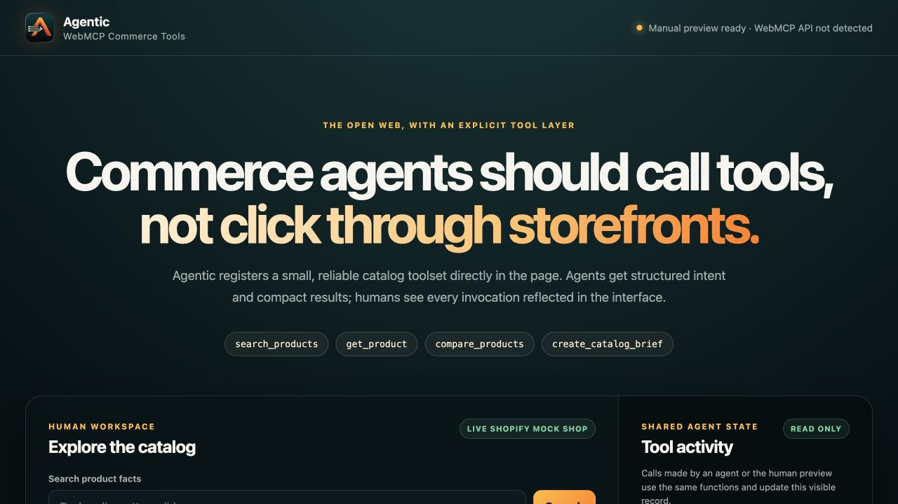

# Agentic WebMCP

[](https://github.com/Somnora/agentic-webmcp/actions/workflows/verify.yml)

Agentic WebMCP is an open-source commerce workspace where humans browse normally while browser agents discover explicit, read-only catalog tools. Tool calls update the visible interface so the human and agent remain oriented to the same products and results.

**Live demo:** [agentic-webmcp.somnora.workers.dev](https://agentic-webmcp.somnora.workers.dev/)



This project is a WebMCP Challenge extension of the pre-existing commercial Agentic Shopify middleware. All code in this repository was created after the challenge submission period opened on August 25, 2026 at 11:00 AM Pacific. The private commercial application is not included and is not required to run this project.

## Registered tools

- `search_products`: search natural-language catalog terms and update product cards.
- `get_product`: inspect current facts and sampled variants for one handle.
- `compare_products`: compare two to four products in a shared visible view.
- `create_catalog_brief`: create a compact Markdown brief grounded in selected catalog facts.

Every tool includes `readOnlyHint: true` and `untrustedContentHint: true`. Descriptions and outputs follow Chrome's recommended WebMCP character budgets.

## Data source

The deployed demo reads Shopify's public [Mock Shop GraphQL API](https://mock.shop/), which requires no merchant or production credentials. If the upstream demo is unavailable, Agentic switches to a small bundled snapshot and labels that state in both API results and the human interface.

## Run locally

Requirements: Node.js 20+ and npm.

```bash
npm install
npm run dev
```

Open the local URL printed by Wrangler. The human preview works in any modern browser. For agent tool discovery, use ChatGPT's WebMCP-capable in-app browser or enable `chrome://flags/#enable-webmcp-testing` in a supported Chrome build.

No credentials are required for the default demo.

## Verify

```bash
npm run typecheck
npm test
npm run verify
```

After deployment:

```bash
AGENTIC_WEBMCP_URL=https://your-worker.example npm run verify:live
```

The current Cloudflare deployment is version `bf588059-89f6-4c34-8c15-93bb63b13a22`. Its seven live smoke checks cover health, workspace delivery, client registration code, privacy disclosure, catalog search, product detail, and invalid-input rejection.

The repository is also verified from a clean public clone in CI; no environment variables or private packages are required.

## Architecture

```text
Top-level browser document
  -> document.modelContext.registerTool(...)
  -> same-origin read-only Worker API
  -> Shopify Mock Shop GraphQL
  -> bounded structured result
  -> visible catalog/activity UI update
```

Static assets and API requests pass through one Cloudflare Worker security boundary. Responses set a restrictive CSP, `Origin-Agent-Cluster: ?1`, a self-only `tools` permissions policy, framing denial, MIME-sniffing protection, and no-referrer behavior. Inputs are validated again in Worker code rather than trusting JSON Schema enforcement.

See [Threat model](docs/THREAT_MODEL.md), [new-work evidence](docs/NEW_WORK_EVIDENCE.md), [evaluation prompts](docs/EVALS.md), and [submission draft](docs/SUBMISSION_COPY.md).

## Privacy and security

The public demo is stateless: it has no accounts, cookies, application database, payment flow, or mutation tools. Its plain-language [privacy disclosure](https://agentic-webmcp.somnora.workers.dev/privacy.html), [security reporting policy](SECURITY.md), and detailed [threat model](docs/THREAT_MODEL.md) are public.

## Relationship to commercial Agentic

The commercial project publishes merchant-authorized Shopify catalog Markdown through signed App Proxy routes. This Hackathon application explores the next interaction layer: pages registering explicit tools browser agents can invoke while updating the human-visible interface.

The projects intentionally use separate repositories, deployments, storage, credentials, test evidence, and release histories. Nothing in this demo weakens or bypasses the commercial app's HMAC, session-token, OAuth, privacy, or billing boundaries.

## License

[MIT](LICENSE)
